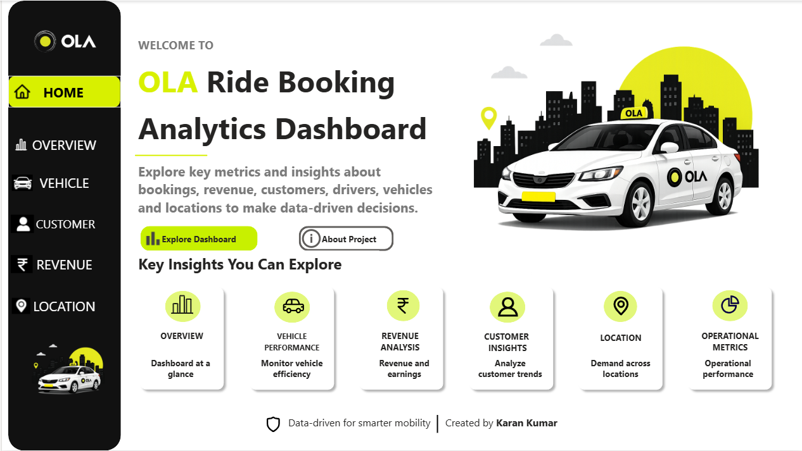

# 🚖 Ola Ride Booking Analytics Dashboard

An interactive Power BI dashboard analyzing ride-booking data to uncover insights on business performance, customer behavior, vehicle utilization, revenue trends, and location analytics.



## 📌 Project Overview

This project simulates a real-world analytics workflow for a ride-hailing business — from raw data to an interactive, multi-page Power BI dashboard used by business stakeholders to make data-driven decisions.

**Business questions answered:**
- Which vehicle types and cities drive the most revenue and bookings?
- What is the cancellation rate, and how does it affect revenue?
- Who are our customers, and what does their booking behavior look like?
- Where and when is demand highest across locations and time of day?
- Which payment methods and locations dominate the platform?

## 🛠️ Tools & Technologies

| Tool | Purpose |
|---|---|
| **Power Query** | Data cleaning and transformation |
| **DAX** | Custom measures and calculated KPIs |
| **Power BI** | Data modeling and interactive dashboard design |
| **Excel** | Initial data inspection and pivot-based exploration |

## 📊 Dashboard Pages

| Page | Description |
|---|---|
| **Home** | Landing page with navigation and project overview |
| **Overview** | Business performance at a glance — bookings, revenue, cancellation rate, ratings |
| **Vehicle** | Fleet performance, utilization rate, and revenue by vehicle type |
| **Customer** | Customer demographics, ratings distribution, repeat customer analysis |
| **Revenue** | Revenue trends, platform vs. driver earnings, payment method breakdown |
| **Location** | Demand by city and pickup/drop-off location, booking patterns by time of day |
| **About Project** | Project background, objective, data source, and scope |

## 🔎 Key Insights

- Revenue shows a strong upward trend, peaking in October, with **Prime Sedan** contributing the highest share of revenue (38.3%) despite Mini having the most bookings.
- **UPI** is the most preferred payment method, followed by credit card and cash.
- **Delhi** leads all cities in both revenue and bookings (34K rides), suggesting some concentration risk worth monitoring for expansion planning.
- Cancellation rate stands at **21.56%**, representing a meaningful revenue impact — a key area for operational improvement.
- Demand rises steadily through the day and peaks in the evening hours, with **IGI Airport** locations among the top pickup and drop-off points.
- Repeat customers make up roughly **75%** of the customer base (defined as 3+ completed rides) — a healthy retention signal for a ride-hailing platform.

## 📁 Repository Structure

```
ola-ride-booking-dashboard/
├── README.md
├── OLA_analytics_Board.pbix
└── screenshots/
    ├── 01_home.png
    ├── 02_overview.png
    ├── 03_vehicle.png
    ├── 04_customer.png
    ├── 05_revenue.png
    ├── 06_location.png
    └── 07_about.png
```

## 📝 Data Notes & Limitations

This dashboard is built on a **synthetically generated** ride-booking dataset, created for learning and portfolio purposes — it does not represent real Ola operational data.

During development, a few data-quality issues were identified and corrected:
- **Driver and customer ratings** were initially generating identical averages due to overlapping distributions in the source data; ratings were adjusted to reflect distinct, realistic distributions.
- **Repeat customer rate** was initially ~99%, which is unrealistically high for a real ride-hailing business. The definition was refined to 3+ completed rides, bringing the metric to a more plausible ~75%.
- **Total drop-offs** initially matched total pickups exactly; this was corrected to exclude cancelled bookings, since a cancelled ride has a pickup attempt but no completed drop-off.

These corrections are documented here deliberately — investigating and fixing unrealistic patterns in a dataset is itself part of the analysis process, and something I'd apply the same way to a real production dataset.

## 🚀 How to Use

1. Download `OLA_analytics_Board.pbix`
2. Open in Power BI Desktop (free download from Microsoft)
3. Use the slicers (Month, City, Vehicle Type) on each page to explore the data interactively

## 👤 Author

**Karan Kumar**

---
*This project was built for educational and portfolio purposes.*
